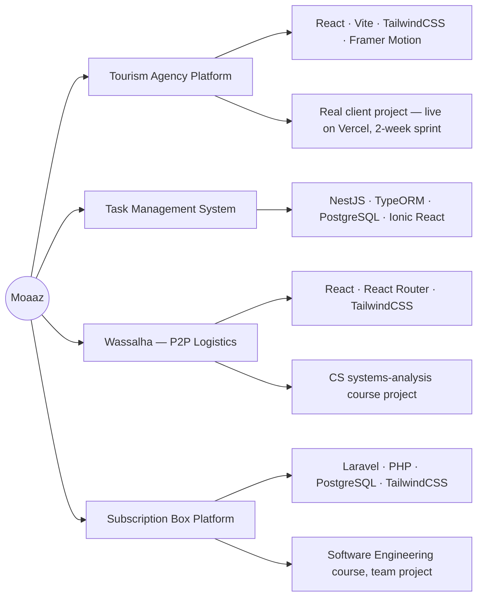
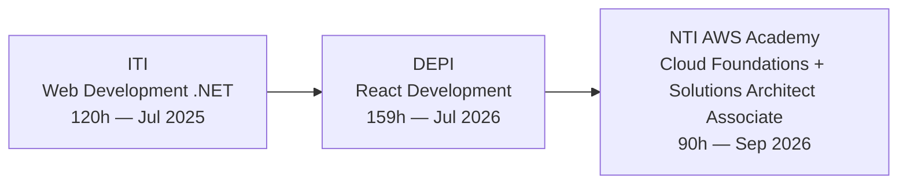
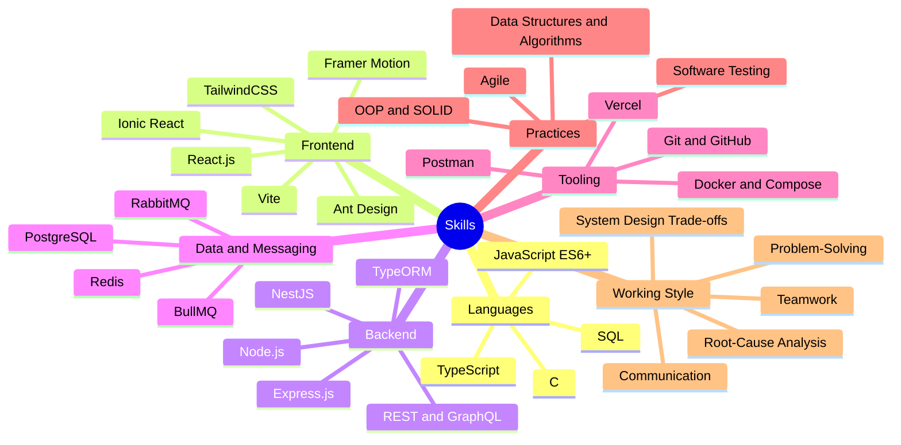

<h1 align="center">Moaaz Hassan Farouk</h1>

📍 Cairo, Egypt &nbsp;•&nbsp; 📧 moazhasanfarouk@gmail.com &nbsp;•&nbsp;
<a href="https://github.com/MoaazHF">GitHub</a> &nbsp;•&nbsp;
<a href="https://linkedin.com/in/moazhasan">LinkedIn</a>

  

---

## 📄 Professional Summary

Full-Stack Developer and Computer Science student focused on backend services, API design, and web platforms
using NestJS, React, TypeScript, PostgreSQL, and Docker. Currently contributing to a Saudi food delivery
platform across ordering, logistics, payments, dashboards, and operational workflows.

---

## 💼 Experience

**Full-Stack Developer** — RobinFood (BAHJA AL-TAUM For IT LLC), Saudi Arabia
`Mar 2026 – Present`

---

## 🧩 Projects

---

## 🎓 Training & Courses

Also working through **Backend from First Principles**, a YouTube playlist I use for self-study on core backend fundamentals and design thinking.

---

## 🛠️ Skills & Abilities

---

## 🏫 Education

**Capital University (Helwan)** — B.Sc. Computer Science
Cairo, Egypt · Expected Graduation: 2028

---

## 🌍 Languages

English — Professional reading, writing, and speaking
