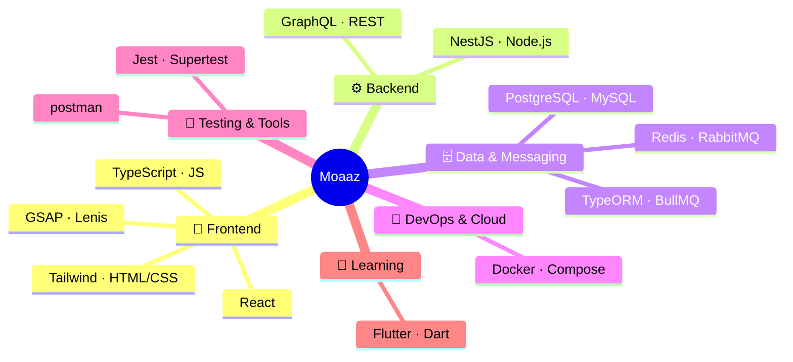

&nbsp;

---

## 🙋 About Me

- 🎓 **CS Student** at [Capital University (Helwan)](https://helwan.edu.eg/) — Class of 2028, GPA 3.1/4
- 💼 **Junior Full Stack Developer** at **RobinFood** — Saudi food delivery platform
- ⚙️ Daily stack: **NestJS · GraphQL · TypeORM · PostgreSQL · RabbitMQ · Redis**
- 🏛️ **DEPI Trainee** — React Web Development Track (159 hrs)
- 🏛️ **ITI Trainee** — Web Development with .NET (120 hrs)
- 🐳 Building containerized production apps with **Docker & Docker Compose**
- 🔗 Passionate about **clean architecture**, **design patterns**, and **scalable APIs**
- 🌱 Currently exploring **Flutter**, **OpenTelemetry**, and **BullMQ**
- 📫 Reach me at **MoazHasanFarouk@gmail.com**

 

---

## 🌐 Connect With Me

  &nbsp;
  &nbsp;
  &nbsp;
  

---

## 🛠️ Technical Skills

**Frontend**

**Backend**

**Database & Messaging**

**DevOps & Tools**

---

## 🗺️ Tech Stack Mind Map

---

## 📊 GitHub Stats

  

---

## 🚀 Featured Projects

<h3>📋 Task Management System — Feb 2026</h3>

> Full-stack Todo app with containerized multi-stage deployment.

| Layer | Tech |
|---|---|
| Backend | NestJS · TypeScript · TypeORM · PostgreSQL |
| Frontend | React.js · Ionic Framework |
| DevOps | Docker · Docker Compose (multi-stage builds) |

<h3>🚚 Wassalha — Logistics Platform — Dec 2025 – Jan 2026</h3>

> Door-to-door personal shipping app with full system analysis & DFD.

| Layer | Tech |
|---|---|
| Frontend | React.js · TailwindCSS · GSAP |
| Concept | System Analysis · Data Flow Diagrams (DFD) |

<h3>📦 Hisab — Inventory Management — May–Jun 2025</h3>

> Collaborative stock tracking and operations management system.

| Layer | Tech |
|---|---|
| Stack | Node.js · PostgreSQL · React.js |
| Testing | CRUD + API endpoint functional testing |

<h3>👔 HR System Manager — Jul–Aug 2025</h3>

> Employee records, attendance, and payroll management.

| Layer | Tech |
|---|---|
| Stack | C# · SQL Server · ASP.NET MVC |

---

## 🎓 Experience & Training

| Period | Organization | Role / Track |
|---|---|---|
| Nov 2025 – Present | **DEPI** | React Web Development — 159 hrs |
| Jul–Aug 2025 | **ITI** | Web Development with .NET — 120 hrs |
| 2024 – 2028 | **Capital University** | B.Sc. Computer Science — GPA 3.1/4 |

---

*"First, solve the problem. Then, write the code."*

