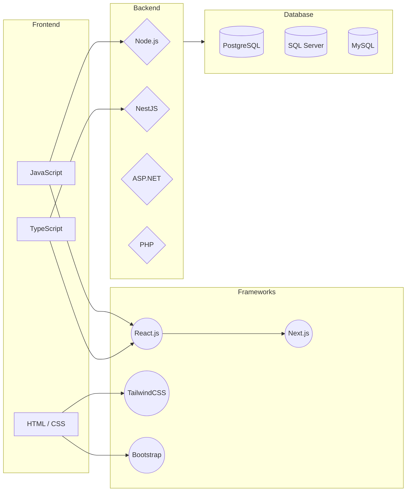

<h1 align="center">Hey, I'm Moaaz </h1>

  

  

---

## <picture></picture> About Me

<picture>
  
</picture>

  

- 🎓 **CS Student** at [Capital University (Helwan)](https://helwan.edu.eg/) — Class of 2028, GPA: 3.1/4
- 💼 **Junior Full Stack Developer** — React.js · NestJS · TypeScript
- 🏛️ **DEPI Trainee** — React Web Development Track (159 hrs)
- 🏛️ **ITI Trainee** — Web Development with .NET (120 hrs)
- 🐳 Building containerized apps with **Docker & Docker Compose**
- 🔗 Passionate about **RESTful APIs**, **Design Patterns**, and clean architecture
- 🌱 Currently mastering **NestJS**, **TypeORM**, and **advanced React patterns**
- 📫 Reach me at **MoazHasanFarouk@gmail.com**

 

---

## <picture></picture> Connect With Me

  
  &emsp;
  
  &emsp;
  
  &emsp;
  

---

##  Technical Skills

<table align="center">
    <tr>
        <td align="center" valign="middle" width="50">
          
        </td>
        <td valign="middle">
          
          
          
          
          
          
          
          
          
          
          
        </td>
    </tr>
    <tr>
        <td align="center" valign="middle" width="50">
          
        </td>
        <td valign="middle">
          
          
          
          
          
          
          
          
          
          
          
        </td>
    </tr>
</table>

---

##  Featured Projects

<h3>📋 Task Management System — Feb 2026</h3>

> A full-stack Todo application for managing daily tasks efficiently.

| Layer | Tech |
|---|---|
| Backend | NestJS · Node.js · TypeScript · TypeORM |
| Frontend | React.js · Ionic Framework · Framer Motion |
| DevOps | Docker · Docker Compose (Multi-stage builds) |

<h3>🚚 Wassalha — Logistics Platform — Dec 2025 – Jan 2026</h3>

> A door-to-door delivery application designed for personal shipping with system analysis & DFD.

| Layer | Tech |
|---|---|
| Frontend | React.js · Framer Motion · TailwindCSS |
| Concept | System Analysis · Data Flow Diagrams (DFD) |

<h3>🛍️ Boof Perfume — E-commerce Platform — Aug 2025 – Sep 2025</h3>

> A full-stack e-commerce experience crafted for the luxury perfume market.

| Layer | Tech |
|---|---|
| Backend | Node.js · Express · PostgreSQL |
| Frontend | React.js · GSAP · Lenis · Framer Motion · TailwindCSS |

<h3>📦 Hisab — Inventory Management System — May 2025 – Jun 2025</h3>

> Full-stack collaborative system to track products, manage stock, and streamline operations.

| Layer | Tech |
|---|---|
| Backend | Node.js · PostgreSQL |
| Frontend | React.js |
| Testing | Functional testing on CRUD operations & API endpoints |

<h3>👔 HR System Manager — Jul 2025 – Aug 2025</h3>

> Employee records, attendance, and payroll management system.

| Layer | Tech |
|---|---|
| Stack | C# · SQL Server · ASP.NET MVC |

---

## 🎓 Experience & Training

| Period | Organization | Track |
|---|---|---|
| Nov 2025 – Present | **DEPI** | React Web Development (159 hrs) |
| Jul 2025 – Aug 2025 | **ITI** | Web Development with .NET (120 hrs) |
| 2024 – 2028 | **Capital University** | B.Sc. Computer Science — GPA 3.1/4 |

---

