<h1 align="center">Moaaz Hassan</h1>

📍 Cairo, Egypt &nbsp;•&nbsp; 📧 moazhasanfarouk@gmail.com &nbsp;•&nbsp;
<a href="https://github.com/MoaazHF">GitHub</a> &nbsp;•&nbsp;
<a href="https://linkedin.com/in/moazhasan">LinkedIn</a>

  

  

## 📄 Professional Summary

Full-Stack Developer and Computer Science student focused on backend services, API design, and web platforms
using NestJS, React, TypeScript, PostgreSQL, and Docker. Currently contributing to a Saudi food delivery
platform across ordering, logistics, payments, dashboards, and operational workflows.

  

## 💼 Experience

  

  

## 🧩 Projects

  

  

## 🎓 Training & Courses

  

  

## 🛠️ Skills & Abilities

  

  

## 🏫 Education

  

  

## 🌍 Languages & Status

  

